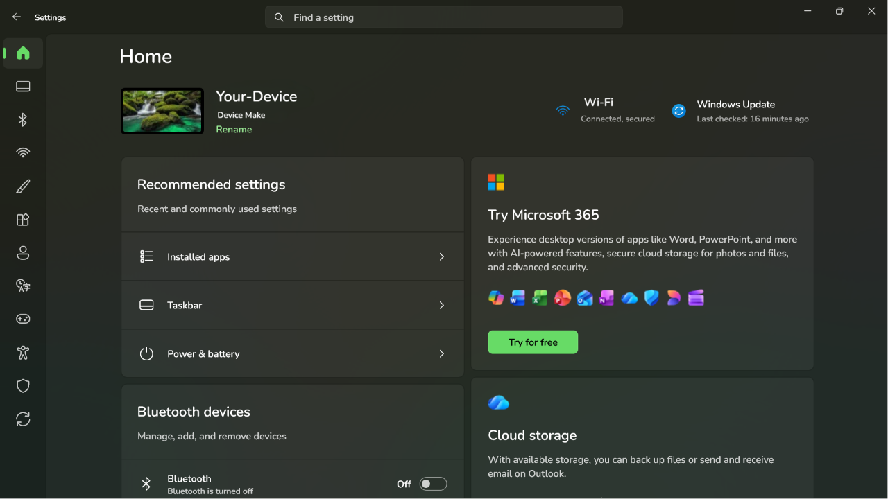
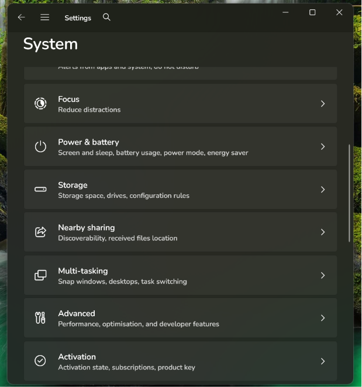
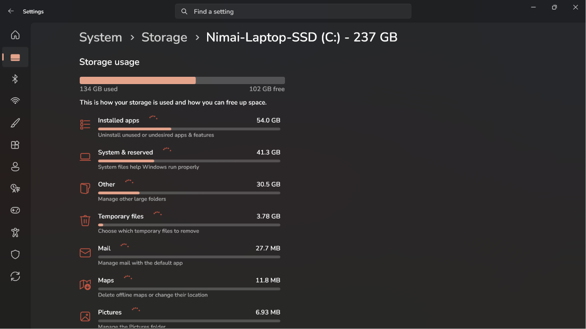
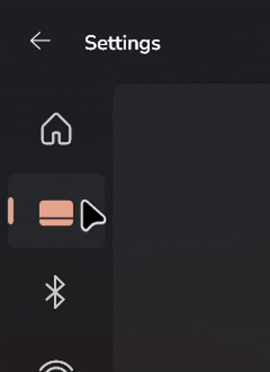

# StoreFrame11 theme for Windows 11 Settings Styler

This theme makes the Settings window use a frame that matches the Microsoft Store.

**Author**: [Nimai-HK](https://github.com/Nimai-HK)
#


<table style="width:100%;">
  <tr>
    <td style="height:20%; text-align:center;"></td>
    <td style="height:20%; text-align:center;"></td>
    <td style="height:100%; text-align:center;"></td>
  </tr>
</table>

## Features
- Uses Microsoft Store frame style for sidebar items.
- Squares the search bar.
- Adds Accenting, tooltips and glyphs to sidebar list items.
- Works in both Light and Dark Modes.
- Partially modernizes the detailed storage breakdown page from its Windows 10 era styling.
- Maintains the default behaviour of autohide sidebar overlay on smaller window sizes and screens.

## Theme selection

The theme is integrated into the mod and can be selected directly from the mod's
settings:

* Open the Windows 11 Settings Styler mod in Windhawk.
* Go to the "Settings" tab.
* Select the theme and save the settings.

## Manual installation

The theme styles can also be imported manually. To do that, follow these steps:

* Open the Windows 11 Settings Styler mod in Windhawk.
* Go to the "Settings" tab and select "Textual mode".
* Copy the content below to the text box and click "Save settings".

<details>
<summary>Content to import (click to expand)</summary>

```yaml
styleConstants:
  - OutRadius=8
  - InRadius=4
  - BgBorder=<SolidColorBrush Color="{ThemeResource Border}" />
  - BgOverlay=<SolidColorBrush Color="{ThemeResource Overlay}" />
  - 'Apps=<Viewbox Width="23" Height="24" Stretch="Uniform" HorizontalAlignment="Center" VerticalAlignment="Center"><PathIcon Data="M 701.82 117.346 C 697.748 117.467 693.689 118.045 689.707 119.363 C 686.011 120.586 686.199 121.121 685.371 121.738 C 684.544 122.355 683.762 122.997 682.863 123.758 C 681.066 125.279 678.863 127.249 676.199 129.695 C 670.872 134.588 663.758 141.342 655.4 149.4 C 638.685 165.517 617.042 186.82 595.473 208.322 C 573.903 229.824 552.419 251.512 536.031 268.395 C 527.837 276.836 520.925 284.066 515.857 289.535 C 513.323 292.27 511.257 294.554 509.654 296.416 C 508.051 298.278 507.44 298.054 505.416 302.299 C 500.14 313.365 499.903 325.866 504.924 337.061 C 506.011 339.484 506.472 339.735 507.086 340.531 C 507.699 341.327 508.358 342.117 509.135 343.021 C 510.688 344.83 512.695 347.053 515.166 349.725 C 520.107 355.068 526.872 362.166 534.91 370.473 C 550.986 387.086 572.123 408.501 593.408 429.807 C 614.693 451.112 636.114 472.295 652.762 488.438 C 661.085 496.509 668.207 503.314 673.582 508.297 C 676.27 510.788 678.511 512.816 680.334 514.389 C 682.157 515.961 681.819 516.515 686.131 518.574 C 697.413 523.963 710.413 523.966 721.701 518.584 C 725.946 516.56 725.722 515.949 727.584 514.346 C 729.446 512.743 731.73 510.677 734.465 508.143 C 739.934 503.075 747.164 496.163 755.605 487.969 C 772.488 471.581 794.176 450.097 815.678 428.527 C 837.18 406.958 858.483 385.315 874.6 368.6 C 882.658 360.242 889.412 353.128 894.305 347.801 C 896.751 345.137 898.721 342.934 900.242 341.137 C 901.003 340.238 901.645 339.456 902.262 338.629 C 902.879 337.801 903.414 337.989 904.637 334.293 C 908.15 323.676 907.715 312.437 902.945 302.287 C 900.915 297.968 900.328 298.261 898.756 296.428 C 897.184 294.594 895.16 292.348 892.676 289.658 C 887.707 284.278 880.926 277.162 872.881 268.848 C 856.791 252.219 835.675 230.836 814.42 209.58 C 793.164 188.325 771.781 167.209 755.152 151.119 C 746.838 143.074 739.722 136.293 734.342 131.324 C 731.652 128.84 729.406 126.816 727.572 125.244 C 725.739 123.672 726.032 123.085 721.713 121.055 C 715.369 118.073 708.609 117.143 701.82 117.346 z M 153.568 181.342 A 11.5012 11.5012 0 0 0 148.701 182.41 L 142.982 185.064 C 133.395 189.515 125.608 197.159 120.93 206.652 L 118.4 211.783 A 11.5012 11.5012 0 0 0 117.217 216.844 L 116.918 364.41 L 116.619 511.977 A 11.5012 11.5012 0 0 0 128.119 523.5 L 287.701 523.5 L 447.283 523.5 A 11.5012 11.5012 0 0 0 458.783 512 L 458.783 365.469 C 458.783 284.201 458.926 246.394 458.025 226.781 C 457.575 216.975 457.064 211.545 455.137 206.373 C 453.209 201.201 449.922 198.208 448.611 196.678 C 445.121 192.6 441.184 189.301 436.559 186.582 L 431.352 183.521 A 11.5012 11.5012 0 0 0 425.549 181.936 L 289.559 181.639 L 153.568 181.342 z M 128.16 565.217 A 11.5012 11.5012 0 0 0 116.66 576.717 L 116.66 720.604 C 116.66 770.286 116.754 806.709 116.953 831.252 C 117.052 843.523 117.177 852.818 117.332 859.371 C 117.41 862.648 117.493 865.231 117.592 867.234 C 117.691 869.237 117.552 869.871 118.127 872.553 C 121.534 888.438 133.659 901.128 149.357 905.348 C 153.656 906.503 155.533 906.25 161.027 906.449 C 166.521 906.648 174.437 906.797 185.803 906.912 C 208.533 907.143 245.012 907.236 302.5 907.266 L 447.277 907.34 A 11.5012 11.5012 0 0 0 458.783 895.84 L 458.783 736.279 L 458.783 576.717 A 11.5012 11.5012 0 0 0 447.283 565.217 L 287.721 565.217 L 128.16 565.217 z M 512 565.217 A 11.5012 11.5012 0 0 0 500.5 576.717 L 500.5 736.299 L 500.5 895.881 A 11.5012 11.5012 0 0 0 512.023 907.381 L 659.59 907.082 L 807.156 906.783 A 11.5012 11.5012 0 0 0 812.217 905.6 L 817.348 903.07 C 826.841 898.392 834.485 890.605 838.936 881.018 L 841.59 875.299 A 11.5012 11.5012 0 0 0 842.658 870.432 L 842.361 734.441 L 842.064 598.451 A 11.5012 11.5012 0 0 0 840.479 592.648 L 837.418 587.441 C 834.699 582.816 831.4 578.879 827.322 575.389 C 825.792 574.078 822.799 570.791 817.627 568.863 C 812.455 566.936 807.025 566.425 797.219 565.975 C 777.606 565.074 739.799 565.217 658.531 565.217 L 512 565.217 z"/></Viewbox>'
  - 'Games=<Viewbox Width="20" Height="19" Stretch="Uniform" HorizontalAlignment="Center" VerticalAlignment="Center"><PathIcon Data="M 110.623 -120.279 C 108.722 -120.279 107.182 -118.738 107.182 -116.838 C 107.182 -114.937 108.722 -113.397 110.623 -113.396 C 112.524 -113.397 114.064 -114.937 114.064 -116.838 C 114.064 -118.738 112.524 -120.279 110.623 -120.279 z M 305.123 -0.257812 C 167.608 13.434 82.6439 103.935 70.6387 121.48 C -18.1232 251.204 5.34591 377.952 9.46094 405.965 C 14.2145 438.325 23.5579 468.04 35.5195 497.795 C 36.3747 500.138 37.2149 502.476 38.2715 504.729 C 41.1966 511.663 43.1933 518.587 46.5469 525.582 C 102.179 641.626 223.481 703.656 295.424 703.641 C 361.645 703.627 333.315 703.922 385.943 703.754 L 483.369 703.443 C 487.759 703.429 533.389 703.621 559.621 703.33 C 610.38 702.768 704.928 703.73 744.312 703.658 C 792.883 703.57 821.111 687.608 852.68 669.836 C 875.445 657.02 911.431 621.342 929.621 602.498 C 997.965 531.697 1009.32 480.423 1019.89 408.557 C 1033.99 312.717 1011.11 212.921 956.035 130.078 C 907.975 57.784 808.161 0.292007 721.553 0.898438 C 718.898 0.917027 672.689 1.21954 620.865 1.07617 C 567.201 0.927722 474.093 0.0141719 441.496 -0.173828 C 356.088 -0.666408 317.409 -1.48108 305.123 -0.257812 z M 771.555 191.719 C 774.683 191.893 777.829 192.292 780.969 192.926 C 790.48 194.845 803.848 201.515 810.764 207.795 C 820.501 216.636 827.485 228.242 830.574 240.713 C 832.6 248.891 832.473 263.957 830.305 272.434 C 824.274 296.014 804.459 314.608 780.471 319.197 C 756.47 323.789 731.256 314.645 717.42 296.33 C 708.082 283.969 704 271.704 704 256 C 704 240.687 707.211 230.454 715.83 218.301 C 728.569 200.339 749.654 190.502 771.555 191.719 z M 288 192 C 295.184 192 296.474 192.27 301.758 194.871 C 309.059 198.465 315.646 205.414 318.186 212.201 C 319.945 216.905 320 218.616 320 268.279 L 320 319.508 L 371.965 319.754 L 423.93 320 L 429.76 322.871 C 441.609 328.706 448 338.912 448 352 C 448 365.088 441.609 375.294 429.76 381.129 L 423.93 384 L 371.965 384.246 L 320 384.492 L 320 435.721 C 320 485.384 319.945 487.095 318.186 491.799 C 315.669 498.526 309.053 505.538 301.902 509.059 C 297.308 511.32 294.922 511.912 289.479 512.141 C 278.806 512.589 270.725 509.071 263.508 500.828 C 255.758 491.977 256 494.071 256 435.721 L 256 384.492 L 204.035 384.246 L 152.07 384 L 146.209 381.115 C 139.049 377.59 132.285 370.4 129.75 363.623 C 127.338 357.177 127.366 346.746 129.814 340.201 C 132.353 333.415 138.941 326.465 146.24 322.871 L 152.07 320 L 204.035 319.754 L 256 319.508 L 256 268.279 C 256 218.616 256.055 216.905 257.814 212.201 C 260.354 205.414 266.941 198.465 274.242 194.871 C 279.526 192.27 280.816 192 288 192 z M 643.555 383.719 C 646.683 383.893 649.829 384.292 652.969 384.926 C 662.48 386.845 675.848 393.515 682.764 399.795 C 692.501 408.636 699.485 420.242 702.574 432.713 C 704.6 440.891 704.473 455.957 702.305 464.434 C 696.274 488.014 676.459 506.608 652.471 511.197 C 628.47 515.789 603.256 506.645 589.42 488.33 C 580.082 475.969 576 463.704 576 448 C 576 432.687 579.211 422.454 587.83 410.301 C 600.569 392.339 621.654 382.502 643.555 383.719 z"/></Viewbox>'
  - 'System=<Viewbox Width="20" Height="20" Stretch="Uniform" HorizontalAlignment="Center" VerticalAlignment="Center"><PathIcon Data="M20,20z M0,0z M19.98,15C19.98,16.38,18.87,17.49,17.49,17.49L2.52,17.49C1.13,17.49,0.02,16.38,0.02,15L0.02,13.74 19.98,13.74 19.98,15z M17.49,2.52C18.87,2.52,19.98,3.63,19.98,5.02L19.98,12.5 0.02,12.5 0.02,5.02C0.02,3.63,1.13,2.52,2.52,2.52L17.49,2.52z" /> </Viewbox>'
  - 'EOA=<Viewbox Width="22" Height="22" Stretch="Uniform" HorizontalAlignment="Center" VerticalAlignment="Center"> <PathIcon Data="M 508.264 -2.78711 C 482.48 -2.38051 456.899 5.27177 434.363 19.25 C 411.663 33.3305 393.168 53.9702 381.559 78.0625 C 373.199 95.4108 368.797 115.928 368.797 135.701 C 368.797 156.54 374.009 178.356 383.455 196.812 C 403.651 236.272 441.825 263.614 485.664 271.922 C 506.828 275.933 524.641 275.015 545.039 269.947 C 585.225 259.963 619.384 233.474 638.006 196.609 C 657.267 158.479 657.094 112.168 637.654 74.0801 C 631.073 61.1858 621.639 48.6144 610.73 38.2207 C 602.112 30.0087 596.422 24.1766 583.039 16.6523 C 559.843 3.61147 534.048 -3.19371 508.264 -2.78711 z M 862.893 184.939 C 856.391 184.757 849.697 185.292 842.996 186.67 C 836.445 188.017 837.18 188.193 835.078 188.873 C 832.976 189.553 830.525 190.377 827.58 191.383 C 821.69 193.395 813.904 196.119 804.617 199.408 C 786.044 205.986 761.534 214.807 735.414 224.34 C 625.643 264.403 574.992 282.988 550.395 291.314 C 525.797 299.641 534.443 296.921 519.488 298.523 C 509.6 299.583 492.797 298.214 481.875 295.168 C 477.612 293.979 441.212 281.228 271.676 219.029 L 187.371 188.102 A 43.33 43.33 0 0 0 172.641 185.451 L 160.693 185.398 A 43.33 43.33 0 0 0 160.688 185.398 C 149.063 185.348 132.412 188.432 123.289 192.508 C 103.381 201.402 88.6472 214.214 78.1758 234.518 C 65.679 258.749 64.4826 280.321 73.8359 305.748 C 80.7765 324.616 92.2513 339.48 109.543 350.604 C 116.295 354.947 116.591 354.434 118.928 355.453 C 121.264 356.472 123.808 357.52 126.854 358.742 C 132.945 361.187 140.94 364.276 150.877 368.035 C 170.75 375.554 198.282 385.709 231.742 397.85 C 261.222 408.546 288.576 418.492 308.881 425.893 C 319.033 429.593 327.426 432.657 333.418 434.854 C 333.937 435.044 333.694 434.955 334.213 435.146 L 334.225 517.873 L 334.238 608.219 L 279.688 752 C 252.253 824.311 237.945 862.097 230.086 884.016 C 222.227 905.935 219.452 918.552 219.057 926.65 C 218.071 946.846 225.23 969.974 237.912 985.961 C 252.209 1003.98 265.351 1012.2 287.264 1017.75 C 294.209 1019.51 296.788 1020.77 308.605 1021 C 327.634 1021.38 335.306 1019.42 351.803 1011.41 C 370.673 1002.26 378.857 995.295 390.09 976.664 C 396.22 966.497 393.56 969.797 394.537 967.459 C 395.514 965.121 396.679 962.25 398.094 958.715 C 400.922 951.645 404.709 942.01 409.24 930.361 C 418.303 907.064 430.319 875.777 443.156 841.992 C 455.93 808.375 467.939 777.063 476.961 753.785 C 481.472 742.146 485.242 732.504 487.949 725.68 C 489.058 722.886 489.85 720.928 490.555 719.195 C 491.355 718.309 493.535 715.082 493.738 714.887 C 498.697 710.132 499.791 709.221 510.963 709.221 C 523.067 709.221 526.643 711.912 529.861 717.336 C 529.99 717.606 530.093 717.774 530.195 718.018 C 530.948 719.809 532.084 722.584 533.482 726.059 C 536.279 733.008 540.156 742.827 544.773 754.65 C 554.008 778.298 566.229 810.028 579.148 843.986 C 604.897 911.664 617.102 944.243 626.404 964.721 C 631.055 974.959 635.175 983.168 642.365 991.516 C 649.555 999.863 658.268 1005.02 661.129 1006.78 C 679.667 1018.19 697.574 1022.6 719.625 1020.39 C 775.186 1014.82 816.131 961.053 799.422 905.939 C 796.732 897.069 796.412 897.333 793.262 888.871 C 790.111 880.409 785.742 868.765 780.451 854.725 C 769.87 826.644 755.612 789.005 740.207 748.527 L 687.076 608.922 L 687.076 517.594 C 687.076 471.723 687.134 448.049 687.408 435.289 C 693.033 433.196 700.141 430.568 709.266 427.215 C 729.245 419.873 756.405 409.956 785.855 399.26 C 815.411 388.525 842.871 378.475 863.377 370.904 C 873.63 367.119 882.135 363.96 888.369 361.613 C 891.486 360.44 894.022 359.475 896.037 358.693 C 898.052 357.912 896.87 358.736 902.672 355.898 C 936.632 339.286 956.576 304.048 952.521 266.188 C 947.406 218.421 908.487 186.216 862.893 184.939 z"/></Viewbox>'
  - 'Personalize=<Viewbox Width="20" Height="20" Stretch="Uniform" HorizontalAlignment="Center" VerticalAlignment="Center"><PathIcon Data="M 958.535 3.11133 C 947.18 3.40174 936.456 6.75756 926.732 11.9199 C 919.819 15.5902 919.638 16.4173 915.17 19.6562 C 910.702 22.8952 904.961 27.1533 898.178 32.2422 C 884.611 42.42 866.933 55.8853 847.975 70.459 C 810.057 99.6063 767.179 133.055 742.133 153.318 C 567.359 294.715 420.316 441.078 266.635 626.514 L 259.141 635.559 A 29.2899 29.2899 0 0 0 272.189 681.949 L 281.182 685.033 L 281.182 685.031 C 288.912 687.682 309.26 697.471 313.463 700.16 C 335.515 714.267 358.805 740.807 368.4 761.658 C 369.9 764.917 371.347 767.77 373.078 770.67 C 373.944 772.12 374.729 773.475 376.58 775.785 C 377.506 776.94 378.488 778.328 381.561 780.789 C 383.097 782.02 385.139 783.646 389.311 785.287 C 393.482 786.928 401.081 788.714 409.732 785.721 C 419.007 782.512 416.67 782.253 417.371 781.748 C 418.073 781.243 418.392 780.985 418.688 780.75 C 419.279 780.28 419.652 779.966 420.074 779.609 C 420.918 778.897 421.842 778.095 422.984 777.096 C 425.269 775.097 428.353 772.364 432.105 769.016 C 439.611 762.318 449.745 753.198 460.771 743.205 C 610.252 607.74 756.081 446.936 876.355 284.943 C 899.082 254.334 931.73 209.162 959.32 170.453 C 973.116 151.099 985.628 133.384 995.021 119.887 C 999.718 113.138 1003.63 107.455 1006.59 103.043 C 1009.56 98.6306 1010.38 98.308 1013.65 91.6895 C 1021.34 76.1408 1023.96 57.418 1017.27 40.5703 C 1010.58 23.7227 995.468 11.7423 979.006 6.16992 C 972.352 3.91765 965.35 2.93705 958.535 3.11133 z M 227.619 688.389 C 220.3 688.583 213.027 689.412 205.715 690.725 C 159.436 699.035 119.738 722.907 100.512 760.834 C 92.4502 776.736 88.8984 794.262 85.8086 823.357 C 81.2234 866.531 67.1948 903.296 51.2051 923.285 C 51.4618 922.964 39.4669 935.514 29.8105 944.547 C 24.9824 949.063 20.2705 953.329 16.9844 956.162 C 15.6312 957.329 14.7842 958.009 14.2051 958.471 C 5.21643 963.512 -1.52148 972.908 -1.52148 984.879 C -1.52148 1000.89 7.7536 1006.69 11.125 1009.04 C 14.4964 1011.39 16.1829 1011.92 17.5312 1012.44 C 20.2279 1013.49 21.4213 1013.71 22.6289 1013.99 C 25.0441 1014.56 26.9036 1014.85 29.084 1015.17 C 33.4448 1015.82 38.6249 1016.4 44.375 1016.89 C 49.5293 1017.33 54.5536 1017.79 58.3984 1018.17 C 62.2433 1018.54 67.4712 1019.32 63.9336 1018.71 C 72.9013 1020.25 74.2123 1019.47 79.9688 1019.4 C 85.7252 1019.34 92.6154 1019.13 99.8008 1018.84 C 114.172 1018.24 128.83 1017.41 138.795 1016.16 C 186.115 1010.2 230.832 997.902 268.658 979.898 C 315.499 957.604 351.523 922.052 364.738 878.094 C 372.42 852.541 371.484 824.144 365.244 798.35 C 354.927 755.7 330.055 720.599 293.408 703.814 C 270.846 693.481 249.57 687.807 227.619 688.389 z M 384.748 732.719 C 384.67 732.787 384.499 732.94 384.424 733.006 C 383.875 733.486 383.638 733.686 383.256 734.016 C 383.318 733.791 383.273 733.501 384.748 732.719 z M 29.0664 954.396 C 25.3372 954.396 21.6268 955.156 18.1309 956.521 C 19.694 955.658 21.8408 954.396 29.0664 954.396 z"/></Viewbox>'
  - 'Shield=<Viewbox Width="20" Height="20" Stretch="Uniform" HorizontalAlignment="Center" VerticalAlignment="Center"><PathIcon Data="M 512 0 C 508.333 0 505.167 0.5 502.5 1.5 C 499.833 2.5 497 3.83337 494 5.5 C 471 19.8334 448.333 33.3334 426 46 C 403.667 58.6667 381.083 70.3334 358.25 81 C 335.417 91.6667 312 101.5 288 110.5 C 264 119.5 239 127.667 213 135 C 200.333 138.667 187.75 141.917 175.25 144.75 C 162.75 147.583 150.167 150.167 137.5 152.5 C 130.167 154.167 122.5 155.417 114.5 156.25 C 106.5 157.083 98.8333 158.5 91.5 160.5 C 83.5 162.833 76.9167 166.333 71.75 171 C 66.5833 175.667 64 182.667 64 192 L 64 480 C 64 550 75.1667 613.167 97.5 669.5 C 119.833 725.833 150.583 776.25 189.75 820.75 C 228.917 865.25 275.083 904.083 328.25 937.25 C 381.417 970.417 438.833 998.667 500.5 1022 C 502.167 1022.67 504.083 1023.17 506.25 1023.5 C 508.417 1023.83 510.333 1024 512 1024 C 516.667 1024 520.5 1023.33 523.5 1022 C 585.167 998.333 642.583 970 695.75 937 C 748.917 904 795.083 865.417 834.25 821.25 C 873.417 777.083 904.167 726.75 926.5 670.25 C 948.833 613.75 960 550.333 960 480 L 960 192 C 960 182.667 957.417 175.667 952.25 171 C 947.083 166.333 940.5 162.833 932.5 160.5 C 925.167 158.5 917.5 157.083 909.5 156.25 C 901.5 155.417 893.833 154.167 886.5 152.5 C 873.833 150.167 861.25 147.583 848.75 144.75 C 836.25 141.917 823.667 138.667 811 135 C 785 127.667 760 119.5 736 110.5 C 712 101.5 688.583 91.6667 665.75 81 C 642.917 70.3334 620.333 58.6667 598 46 C 575.667 33.3334 553 19.8334 530 5.5 C 527 3.83337 524.167 2.5 521.5 1.5 C 518.833 0.5 515.667 0 512 0 z"/></Viewbox>'
controlStyles:
  - target: Border > Frame > ContentPresenter > SystemSettings.View.RootPage > Grid#RootPageGrid > Microsoft.UI.Xaml.Controls.NavigationView#PermanentNavigationView > Grid#RootGrid > Grid > SplitView#RootSplitView > Grid > Grid#ContentRoot > Border > Grid#ContentGrid > ContentPresenter#ContentPresenter
    styles:
      - Margin=2
  - target: Grid#ContentRoot > Border > Grid#ContentGrid > ContentControl#HeaderContent
    styles:
      - Margin=10,-38,0,5
  - target: SplitView#RootSplitView > Grid > Grid#PaneRoot > Border > Grid#PaneContentGrid > Grid#ItemsContainerGrid > Microsoft.UI.Xaml.Controls.ItemsRepeaterScrollHost > ScrollViewer#MenuItemsScrollViewer > Border#Root > Grid > ScrollContentPresenter#ScrollContentPresenter
    styles:
      - Margin=-12,8,0,0
  - target: TextBox#CommandSearchTextBox > Grid > Button#DeleteButton > Grid#ButtonLayoutGrid
    styles:
      - CornerRadius=$InRadius
      - MinHeight=32
  - target: TextBox#CommandSearchTextBox
    styles:
      - CornerRadius=$InRadius
      - MinHeight=32
  - target: StackPanel#SettingsCommandSearchBoxBackground
    styles:
      - CornerRadius=$InRadius
      - MinHeight=32
  - target: SplitView#RootSplitView > Grid > Grid#PaneRoot > Border > Grid#PaneContentGrid > Grid#ItemsContainerGrid > Microsoft.UI.Xaml.Controls.ItemsRepeaterScrollHost > ScrollViewer#MenuItemsScrollViewer > Border#Root > Grid > ScrollContentPresenter#ScrollContentPresenter > Microsoft.UI.Xaml.Controls.ItemsRepeater#MenuItemsHost > SystemSettings.View.SettingsNavigationViewItem > Grid#NVIRootGrid > Microsoft.UI.Xaml.Controls.Primitives.NavigationViewItemPresenter#NavigationViewItemPresenter > Grid#LayoutRoot > Grid#PresenterContentRootGrid > Grid#ContentGrid > ContentPresenter#ContentPresenter > TextBlock
    styles:
      - Grid.Column=0
      - Visibility=Hidden
  - target: SplitView#RootSplitView > Grid > Grid#PaneRoot > Border > Grid#PaneContentGrid > Grid#ItemsContainerGrid > Microsoft.UI.Xaml.Controls.ItemsRepeaterScrollHost > ScrollViewer#MenuItemsScrollViewer > Border#Root > Grid > ScrollContentPresenter#ScrollContentPresenter > Microsoft.UI.Xaml.Controls.ItemsRepeater#MenuItemsHost > SystemSettings.View.SettingsNavigationViewItem
    styles:
      - MinHeight=48
      - MinWidth=65
      - ToolTipService.Placement=5
      - MaxWidth=65
  - target: Microsoft.UI.Xaml.Controls.NavigationView#PermanentNavigationView > Grid#RootGrid > Grid > SplitView#RootSplitView > Grid@DisplayModeStates > Grid#PaneRoot
    styles:
      - MaxWidth@OpenInlineLeft=65
      - Grid.ColumnSpan@OpenInlineLeft=1
      - Grid.ColumnSpan=>Span
  - target: SplitView#RootSplitView > Grid > Grid#ContentRoot > Border > Grid#ContentGrid
    styles:
      - Background:=$BgOverlay
      - 'CornerRadius={{Span > 1 ? 0 : $OutRadius}},0,0,0'
      - 'Margin={{Span > 1 ? 0 : 65}},48,0,0'
      - BorderBrush:=$BgBorder
      - 'BorderThickness={{Span > 1 ? 0 : 1}},1,0,0'
  - target: Microsoft.UI.Xaml.Controls.NavigationView#PermanentNavigationView > Grid#RootGrid > Grid > SplitView#RootSplitView > Grid@DisplayModeStates > Grid#ContentRoot
    styles:
      - Grid.Column@OpenInlineLeft=0
      - Grid.ColumnSpan@OpenInlineLeft=3
  - target: Microsoft.UI.Xaml.Controls.NavigationView#PermanentNavigationView > Grid#RootGrid > Grid > Grid#ShadowCaster
    styles:
      - Grid.ColumnSpan=1
      - MaxWidth=65
  - target: SystemSettings.View.SettingsNavigationViewItem > Grid#NVIRootGrid > Microsoft.UI.Xaml.Controls.Primitives.NavigationViewItemPresenter#NavigationViewItemPresenter > Grid#LayoutRoot > Grid#PresenterContentRootGrid > Grid#ContentGrid > ContentPresenter#ContentPresenter > TextBlock
    styles:
      - Padding=3,0,0,0
  - target: SystemSettings.View.SettingsNavigationViewItem > Grid#NVIRootGrid > Microsoft.UI.Xaml.Controls.Primitives.NavigationViewItemPresenter#NavigationViewItemPresenter > Grid#LayoutRoot@PointerStates > Grid#PresenterContentRootGrid > Grid#ContentGrid > Border#IconColumn > Viewbox#IconBox > Border > ContentPresenter#Icon
    styles:
      - FontFamily=Segoe Fluent Icons
      - Foreground@Normal:=<SolidColorBrush Color="{ThemeResource TextFillColorSecondary}" />
      - Foreground@PointerOver:=<SolidColorBrush Color="{ThemeResource TextFillColorPrimary}" />
      - Foreground@Pressed:=<SolidColorBrush Color="{ThemeResource TextFillColorPrimary}" />
      - Foreground@Selected:=<SolidColorBrush Color="{ThemeResource Accent}" />
      - Foreground@PointerOverSelected:=<SolidColorBrush Color="{ThemeResource Accent}" />
      - Foreground@PressedSelected:=<SolidColorBrush Color="{ThemeResource Accent}" />
      - FontSize=20
      - Margin=15,0,-2,0
  - target: SystemSettings.View.SettingsNavigationViewItem[Content=Home] > Grid#NVIRootGrid > Microsoft.UI.Xaml.Controls.Primitives.NavigationViewItemPresenter#NavigationViewItemPresenter > Grid#LayoutRoot@PointerStates > Grid#PresenterContentRootGrid > Grid#ContentGrid > Border#IconColumn > Viewbox#IconBox > Border > ContentPresenter#Icon
    styles:
      - Content@Normal:=
      - Content@PointerOver:=
      - Content@Pressed:=
      - Content@Selected:=
      - Content@PointerOverSelected:=
      - Content@PressedSelected:=
  - target: SystemSettings.View.SettingsNavigationViewItem[Content=System] > Grid#NVIRootGrid > Microsoft.UI.Xaml.Controls.Primitives.NavigationViewItemPresenter#NavigationViewItemPresenter > Grid#LayoutRoot@PointerStates > Grid#PresenterContentRootGrid > Grid#ContentGrid > Border#IconColumn > Viewbox#IconBox > Border > ContentPresenter#Icon
    styles:
      - Content@Normal:=
      - Content@PointerOver:=
      - Content@Pressed:=
      - Content@Selected:=$System
      - Content@PointerOverSelected:=$System
      - Content@PressedSelected:=$System
  - target: SystemSettings.View.SettingsNavigationViewItem[3] > Grid#NVIRootGrid > Microsoft.UI.Xaml.Controls.Primitives.NavigationViewItemPresenter#NavigationViewItemPresenter > Grid#LayoutRoot@PointerStates > Grid#PresenterContentRootGrid > Grid#ContentGrid > Border#IconColumn > Viewbox#IconBox > Border > ContentPresenter#Icon
    styles:
      - Content@Normal:=
      - Content@PointerOver:=
      - Content@Pressed:=
      - Content@Selected:=
      - Content@PointerOverSelected:=
      - Content@PressedSelected:=
  - target: SystemSettings.View.SettingsNavigationViewItem[4] > Grid#NVIRootGrid > Microsoft.UI.Xaml.Controls.Primitives.NavigationViewItemPresenter#NavigationViewItemPresenter > Grid#LayoutRoot@PointerStates > Grid#PresenterContentRootGrid > Grid#ContentGrid > Border#IconColumn > Viewbox#IconBox > Border > ContentPresenter#Icon
    styles:
      - Content@Normal:=
      - Content@PointerOver:=
      - Content@Pressed:=
      - Content@Selected:=$Shield
      - Content@PointerOverSelected:=$Shield
      - Content@PressedSelected:=$Shield
  - target: SystemSettings.View.SettingsNavigationViewItem[5] > Grid#NVIRootGrid > Microsoft.UI.Xaml.Controls.Primitives.NavigationViewItemPresenter#NavigationViewItemPresenter > Grid#LayoutRoot@PointerStates > Grid#PresenterContentRootGrid > Grid#ContentGrid > Border#IconColumn > Viewbox#IconBox > Border > ContentPresenter#Icon
    styles:
      - Content@Normal:=
      - Content@PointerOver:=
      - Content@Pressed:=
      - Content@Selected:=$EOA
      - Content@PointerOverSelected:=$EOA
      - Content@PressedSelected:=$EOA
  - target: SystemSettings.View.SettingsNavigationViewItem[6] > Grid#NVIRootGrid > Microsoft.UI.Xaml.Controls.Primitives.NavigationViewItemPresenter#NavigationViewItemPresenter > Grid#LayoutRoot@PointerStates > Grid#PresenterContentRootGrid > Grid#ContentGrid > Border#IconColumn > Viewbox#IconBox > Border > ContentPresenter#Icon
    styles:
      - Content@Normal:=
      - Content@PointerOver:=
      - Content@Pressed:=
      - Content@Selected:=$Games
      - Content@PointerOverSelected:=$Games
      - Content@PressedSelected:=$Games
  - target: SystemSettings.View.SettingsNavigationViewItem[7] > Grid#NVIRootGrid > Microsoft.UI.Xaml.Controls.Primitives.NavigationViewItemPresenter#NavigationViewItemPresenter > Grid#LayoutRoot@PointerStates > Grid#PresenterContentRootGrid > Grid#ContentGrid > Border#IconColumn > Viewbox#IconBox > Border > ContentPresenter#Icon
    styles:
      - Content@Normal:=
      - Content@PointerOver:=
      - Content@Pressed:=
      - Content@Selected:=
      - Content@PointerOverSelected:=
      - Content@PressedSelected:=
  - target: SystemSettings.View.SettingsNavigationViewItem[8] > Grid#NVIRootGrid > Microsoft.UI.Xaml.Controls.Primitives.NavigationViewItemPresenter#NavigationViewItemPresenter > Grid#LayoutRoot@PointerStates > Grid#PresenterContentRootGrid > Grid#ContentGrid > Border#IconColumn > Viewbox#IconBox > Border > ContentPresenter#Icon
    styles:
      - Content@Normal:=
      - Content@PointerOver:=
      - Content@Pressed:=
      - Content@Selected:=
      - Content@PointerOverSelected:=
      - Content@PressedSelected:=
  - target: SystemSettings.View.SettingsNavigationViewItem[9] > Grid#NVIRootGrid > Microsoft.UI.Xaml.Controls.Primitives.NavigationViewItemPresenter#NavigationViewItemPresenter > Grid#LayoutRoot@PointerStates > Grid#PresenterContentRootGrid > Grid#ContentGrid > Border#IconColumn > Viewbox#IconBox > Border > ContentPresenter#Icon
    styles:
      - Content@Normal:=
      - Content@PointerOver:=
      - Content@Pressed:=
      - Content@Selected:=$Apps
      - Content@PointerOverSelected:=$Apps
      - Content@PressedSelected:=$Apps
  - target: SystemSettings.View.SettingsNavigationViewItem[10] > Grid#NVIRootGrid > Microsoft.UI.Xaml.Controls.Primitives.NavigationViewItemPresenter#NavigationViewItemPresenter > Grid#LayoutRoot@PointerStates > Grid#PresenterContentRootGrid > Grid#ContentGrid > Border#IconColumn > Viewbox#IconBox > Border > ContentPresenter#Icon
    styles:
      - Content@Normal:=
      - Content@PointerOver:=
      - Content@Pressed:=
      - Content@Selected:=$Personalize
      - Content@PointerOverSelected:=$Personalize
      - Content@PressedSelected:=$Personalize
  - target: SystemSettings.View.SettingsNavigationViewItem[11] > Grid#NVIRootGrid > Microsoft.UI.Xaml.Controls.Primitives.NavigationViewItemPresenter#NavigationViewItemPresenter > Grid#LayoutRoot@PointerStates > Grid#PresenterContentRootGrid > Grid#ContentGrid > Border#IconColumn > Viewbox#IconBox > Border > ContentPresenter#Icon
    styles:
      - Content@Normal:=
      - Content@PointerOver:=
      - Content@Pressed:=
      - Content@Selected:=
      - Content@PointerOverSelected:=
      - Content@PressedSelected:=
  - target: SystemSettings.View.SettingsNavigationViewItem[12] > Grid#NVIRootGrid > Microsoft.UI.Xaml.Controls.Primitives.NavigationViewItemPresenter#NavigationViewItemPresenter > Grid#LayoutRoot@PointerStates > Grid#PresenterContentRootGrid > Grid#ContentGrid > Border#IconColumn > Viewbox#IconBox > Border > ContentPresenter#Icon
    styles:
      - Content@Normal:=
      - Content@PointerOver:=
      - Content@Pressed:=
      - Content@Selected:=
      - Content@PointerOverSelected:=
      - Content@PressedSelected:=
  - target: SystemSettings.View.SettingsNavigationViewItem[1]
    styles:
      - Content=>t1
      - ToolTipService.ToolTip={{t1}}
  - target: SystemSettings.View.SettingsNavigationViewItem[2]
    styles:
      - Content=>t2
      - ToolTipService.ToolTip={{t2}}
  - target: SystemSettings.View.SettingsNavigationViewItem[3]
    styles:
      - Content=>t3
      - ToolTipService.ToolTip={{t3}}
  - target: SystemSettings.View.SettingsNavigationViewItem[4]
    styles:
      - Content=>t4
      - ToolTipService.ToolTip={{t4}}
  - target: SystemSettings.View.SettingsNavigationViewItem[5]
    styles:
      - Content=>t5
      - ToolTipService.ToolTip={{t5}}
  - target: SystemSettings.View.SettingsNavigationViewItem[6]
    styles:
      - Content=>t6
      - ToolTipService.ToolTip={{t6}}
  - target: SystemSettings.View.SettingsNavigationViewItem[7]
    styles:
      - Content=>t7
      - ToolTipService.ToolTip={{t7}}
  - target: SystemSettings.View.SettingsNavigationViewItem[8]
    styles:
      - Content=>t8
      - ToolTipService.ToolTip={{t8}}
  - target: SystemSettings.View.SettingsNavigationViewItem[9]
    styles:
      - Content=>t9
      - ToolTipService.ToolTip={{t9}}
  - target: SystemSettings.View.SettingsNavigationViewItem[10]
    styles:
      - Content=>t10
      - ToolTipService.ToolTip={{t10}}
  - target: SystemSettings.View.SettingsNavigationViewItem[11]
    styles:
      - Content=>t11
      - ToolTipService.ToolTip={{t11}}
  - target: SystemSettings.View.SettingsNavigationViewItem[12]
    styles:
      - Content=>t12
      - ToolTipService.ToolTip={{t12}}
  - target: SplitView#RootSplitView > Grid > Grid#PaneRoot > Border > Grid#PaneContentGrid > ContentControl#PaneCustomContentBorder > ContentPresenter > SystemSettings.View.SpacingStackPanel > SystemSettings.View.UserProfileControl#UserProfileControl > Button#UserProfileButton > ContentPresenter#ContentPresenter > Grid#UserProfileLayout > Grid[2]
    styles:
      - Visibility=1
      - Grid.Column=0
  - target: ContentControl#PaneCustomContentBorder > ContentPresenter > SystemSettings.View.SpacingStackPanel > SystemSettings.View.UserProfileControl#UserProfileControl > Button#UserProfileButton > ContentPresenter#ContentPresenter > Grid#UserProfileLayout > Grid[2] > TextBlock#UserName
    styles:
      - Text=>UserName
  - target: ContentControl#PaneCustomContentBorder > ContentPresenter > SystemSettings.View.SpacingStackPanel > SystemSettings.View.UserProfileControl#UserProfileControl > Button#UserProfileButton
    styles:
      - ToolTipService.ToolTip={{UserName}}
      - ToolTipService.Placement=10
      - Visibility=1
  - target: ContentControl#PaneCustomContentBorder > ContentPresenter > SystemSettings.View.SpacingStackPanel > SystemSettings.View.UserProfileControl#UserProfileControl > Button#UserProfileButton > ContentPresenter#ContentPresenter > Grid#UserProfileLayout > Grid#UserImageGrid > Image
    styles:
      - Width=30
      - Height=30
  - target: SplitView#RootSplitView > Grid > Grid#PaneRoot > Border > Grid#PaneContentGrid > ContentControl#PaneCustomContentBorder > ContentPresenter > SystemSettings.View.SpacingStackPanel
    styles:
      - MaxHeight=48
      - MaxWidth=65
      - MinHeight=48
      - MinWidth=65
      - Visibility=1
  - target: SplitView#RootSplitView > Grid > Grid#PaneRoot > Border > Grid#PaneContentGrid > ContentControl#PaneCustomContentBorder > ContentPresenter > SystemSettings.View.SpacingStackPanel > SystemSettings.View.UserProfileControl#UserProfileControl > Button#UserProfileButton
    styles:
      - MinHeight=48
      - MaxHeight=48
      - Margin=3,3,3,-3
  - target: Windows.UI.Xaml.Shapes.Rectangle#ProgressBarIndicator
    styles:
      - RadiusX=3
      - RadiusY=3
      - Height=6
      - Fill:=<SolidColorBrush Color="{ThemeResource Accent}"/>
  - target: Windows.UI.Xaml.Controls.Border#DeterminateRoot
    styles:
      - CornerRadius=3
      - Height=6
  - target: Windows.UI.Xaml.Controls.ProgressBar
    styles:
      - Height=6
  - target: Windows.UI.Xaml.Controls.StackPanel#TopBreakdownBar > Windows.UI.Xaml.Controls.ProgressBar > Windows.UI.Xaml.Controls.Grid > Windows.UI.Xaml.Controls.Border#DeterminateRoot > Windows.UI.Xaml.Shapes.Rectangle#ProgressBarIndicator
    styles:
      - Height=16
  - target: Windows.UI.Xaml.Controls.StackPanel#TopBreakdownBar > Windows.UI.Xaml.Controls.ProgressBar > Windows.UI.Xaml.Controls.Grid > Windows.UI.Xaml.Controls.Border#DeterminateRoot
    styles:
      - Height=16
  - target: Windows.UI.Xaml.Controls.StackPanel#TopBreakdownBar > Windows.UI.Xaml.Controls.ProgressBar
    styles:
      - Height=16
  - target: Rectangle#SelectionIndicator
    styles:
      - Height=22
  - target: Windows.UI.Xaml.Shapes.Rectangle#ThumbVisual
    styles:
      - Visibility=Collapsed
themeResourceVariables:
  - Overlay@Light=#55FFFFFF
  - Overlay@Dark=#09FFFFFF
  - Border@Light=#0F000000
  - Border@Dark=#19000000
  - Accent@Dark={ThemeResource SystemAccentColorLight2}
  - Accent@Light={ThemeResource SystemAccentColorDark1}
```
</details>
