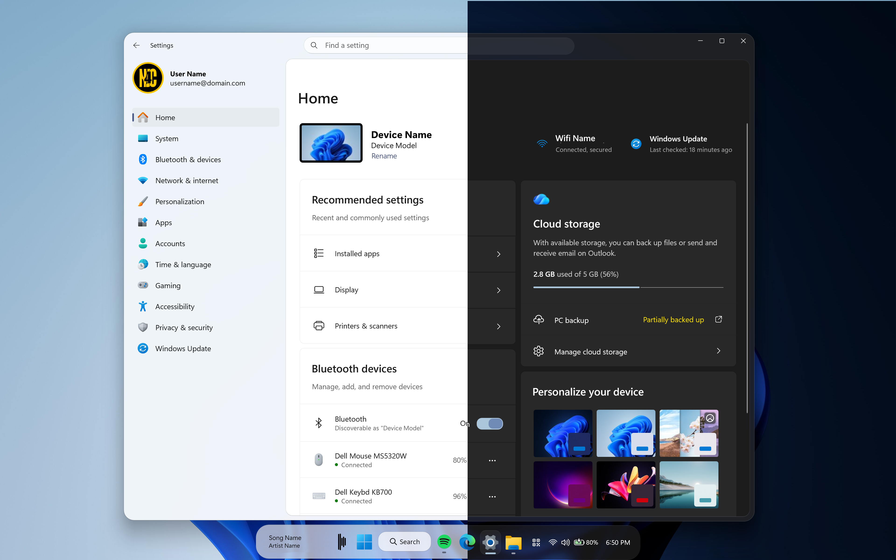

# WindowGlass theme for Windows 11 Start Menu Styler

A theme that adds a modern, glassy aesthetic with a compact layout to the Windows 11 Settings App .

**Author**: [Nathaniel4JC](https://github.com/Nathaniel4JC)



## Notes
- This theme works best on Windows 11 **25H2** and later.
- This theme currently works on displays with a resolution **of or above** 1366x768.
- This theme consists of **three** backgrounds:
    - Glass
    - Frosted
    - Acrylic
  - In order to switch between these backgrounds, replace the value for "Background" with "$Glass", "$Frosted" or "$Acrylic".
- To change the app's corner radius, install the 'Custom Window Corner Radius' Mod and use the paste the following in the 'Advanced' section:
 ```json
{"radius":20,"smallRadius":6,"tooltipRadius":-1}
```

## Bonus
- This theme can style other UWP Applications as well. 
- To make it work, you'll need to:
  - Add any of the following UWP apps to the 'Custom process inclusion list' under 'Advanced settings' in the Windows 11 Settings Styler mod:
  CalculatorApp.exe
  GameBar.exe
  Microsoft.Media.Player.exe
  mspaint.exe
  Taskmgr.exe
  Time.exe
  Todo.exe
  SecHealthUI.exe
  SystemSettings.exe
  VoiceRecorder.exe
  Whatsapp.exe
  WindowsCamera.exe
  WinStore.App.exe
  WindowsBackupClient.exe
  WindowsTerminal.exe

## For a complete WindowGlass-themed UI, download the following mods and use the 'WindowGlass' theme:
- Windows 11 Taskbar Styler - for styling the taskbar.
- Windows 11 Notification Center Styler - for styling the Notification Center and Action Center.
- Windows 11 File Explorer Styler - for styling Windows Explorer windows.
- Windows 11 Start Menu Styler - for styling the Windows 11 Start Menu

---

## Theme selection

The theme is integrated into the mod and can simply be selected from the mod's
settings:

* Open the Windows 11 Settings Styler mod in Windhawk.
* Go to the "Settings" tab.
* Select the theme and save the settings.

## Manual installation

The theme styles can also be imported manually. To do that, follow these steps:

* Open the Windows 11 Settings Styler mod in Windhawk.
* Go to the "Advanced" tab.
* Copy the content below to the text box under "Mod settings" and click "Save".

<details>
<summary>Content to import (click to expand)</summary>

```json
{
  "// Style Constants //": "",
  "styleConstants[0]": "Glass=<WindhawkBlur BlurAmount=\"3\" TintColor=\"{ThemeResource SystemChromeMediumColor}\" TintOpacity=\"0.7\" />",
  "styleConstants[1]": "Frosted=<WindhawkBlur BlurAmount=\"20\" TintColor=\"{ThemeResource SystemChromeMediumColor}\" TintOpacity=\"0.7\" />",
  "styleConstants[2]": "Acrylic=<AcrylicBrush TintColor=\"{ThemeResource SystemChromeAltHighColor}\" TintOpacity=\"0.3\" FallbackColor=\"{ThemeResource SystemChromeAltHighColor}\" />",
  "styleConstants[3]": "BorderBrush=<LinearGradientBrush StartPoint=\"0,0\" EndPoint=\"0,1\"><GradientStop Color=\"#50808080\" Offset=\"0.0\" /><GradientStop Color=\"#50404040\" Offset=\"0.25\" /><GradientStop Color=\"#50808080\" Offset=\"1\" /></LinearGradientBrush>",
  "styleConstants[4]": "BorderBrush2=<LinearGradientBrush StartPoint=\"0,0\" EndPoint=\"0,1\"><GradientStop Color=\"{ThemeResource SystemChromeHighColor}\" Offset=\"0.0\" /><GradientStop Color=\"{ThemeResource SystemChromeLowColor}\" Offset=\"0.15\" /><GradientStop Color=\"{ThemeResource SystemChromeHighColor}\" Offset=\"0.95\" /></LinearGradientBrush>",
  "styleConstants[5]": "overlay=<SolidColorBrush Color=\"{ThemeResource SystemChromeAltHighColor}\" Opacity=\"0.1\" />",
  "styleConstants[6]": "overlay2=<WindhawkBlur BlurAmount=\"20\" TintColor=\"#60353535\"/>",
  "styleConstants[7]": "CornerRadius=30",
  "styleConstants[8]": "CR2=14",
  "styleConstants[9]": "CR3=12",
  "styleConstants[10]": "BorderThickness=0.3,1,0.3,0.3",
  "styleConstants[11]": "ElementBG=<SolidColorBrush Color=\"{ThemeResource SystemChromeAltHighColor}\" Opacity=\"1\" />",
  "styleConstants[12]": "ElementBorderBrush=<LinearGradientBrush StartPoint=\"0,0\" EndPoint=\"0,1\"><GradientStop Color=\"#50808080\" Offset=\"1\" /><GradientStop Color=\"#50606060\" Offset=\"0.15\" /></LinearGradientBrush>",
  "styleConstants[13]": "ElementCornerRadius=30",
  "styleConstants[14]": "ElementBorderThickness=0.3,0.3,0.3,1",
  "styleConstants[15]": "ElementSysColor=<SolidColorBrush Color=\"{ThemeResource SystemAccentColorLight1}\" Opacity=\"1\" />",
  "styleConstants[16]": "ElementSysColor2=<SolidColorBrush Color=\"{ThemeResource SystemAccentColorLight2}\" Opacity=\"1\" />",
  "styleConstants[17]": "ElementSysColor3=<SolidColorBrush Color=\"{ThemeResource SystemAccentColorLight3}\" Opacity=\"1\" />",
  "styleConstants[18]": "ElementSysColor4=<SolidColorBrush Color=\"{ThemeResource SystemAccentColorDark1}\" Opacity=\"1\" />",
  "// Sidebar //": "",
  "controlStyles[0].target": "Windows.UI.Xaml.Controls.Grid#ContentRoot > Windows.UI.Xaml.Controls.Border > Windows.UI.Xaml.Controls.Grid#ContentGrid",
  "controlStyles[0].styles[0]": "Background:=$ElementBG",
  "controlStyles[0].styles[1]": "BorderBrush:=$ElementBorderBrush",
  "controlStyles[0].styles[2]": "CornerRadius=13",
  "controlStyles[0].styles[3]": "BorderThickness=$ElementBorderThickness",
  "controlStyles[1].target": "Windows.UI.Xaml.Controls.RelativePanel#PaneContentGrid > Windows.UI.Xaml.Controls.ContentPresenter",
  "controlStyles[1].styles[0]": "Background:=$ElementBG",
  "// Search//": "",
  "controlStyles[2].target": "WinStore.UX.Controls.SearchAutoSuggestBox#SearchBox > Windows.UI.Xaml.Controls.AutoSuggestBox#SearchTextBox > Windows.UI.Xaml.Controls.Grid#LayoutRoot > Windows.UI.Xaml.Controls.TextBox#TextBox > Windows.UI.Xaml.Controls.Grid > Windows.UI.Xaml.Controls.Border#BorderElement",
  "controlStyles[2].styles[0]": "CornerRadius=20",
  "// Media Bar//": "",
  "controlStyles[3].target": "Windows.UI.Xaml.Controls.Grid#ControlPanelGrid",
  "controlStyles[3].styles[0]": "CornerRadius=$CornerRadius",
  "controlStyles[3].styles[1]": "BorderBrush:=$BorderBrush",
  "controlStyles[3].styles[2]": "Background:=$Glass",
  "controlStyles[3].styles[3]": "BorderThickness=$BorderThickness",
  "controlStyles[3].styles[4]": "Width=Auto",
  "controlStyles[3].styles[5]": "Margin=100,0,100,-150",
  "controlStyles[3].styles[6]": "Height=Auto",
  "controlStyles[3].styles[7]": "MaxWidth:=700",
  "controlStyles[3].styles[8]": "MinWidth:=15",
  "controlStyles[3].styles[9]": "MinHeight:=15",
  "controlStyles[3].styles[10]": "MaxHeight:=300",
  "controlStyles[3].styles[11]": "HorizontalAlignment=1",
  "controlStyles[3].styles[12]": "RenderTransform:=<TranslateTransform X=\"0\" Y=\"-170\"/>",
  "controlStyles[4].target": "Windows.UI.Xaml.Controls.Primitives.ToggleButton#mtcMediaInformationButton",
  "controlStyles[4].styles[0]": "CornerRadius=$CornerRadius",
  "controlStyles[4].styles[1]": "Padding=10",
  "controlStyles[4].styles[2]": "Margin=20,0,0,0",
  "controlStyles[5].target": "Windows.UI.Xaml.Controls.Border#MediaTransportControls_Timeline_Border",
  "controlStyles[5].styles[0]": "RenderTransform:=<TranslateTransform Y=\"25\"/>",
  "controlStyles[6].target": "Windows.UI.Xaml.Controls.Primitives.ToggleButton#mtcMediaInformationButton > Windows.UI.Xaml.Controls.ContentPresenter#ContentPresenter",
  "controlStyles[6].styles[0]": "RenderTransform:=<TranslateTransform Y=\"25\"/>",
  "controlStyles[7].target": "Windows.UI.Xaml.Controls.StackPanel#MediaControlsCommandBar_Center_Container",
  "controlStyles[7].styles[0]": "RenderTransform:=<TranslateTransform Y=\"25\"/>",
  "controlStyles[8].target": "Windows.UI.Xaml.Controls.Border#MediaControlsCommandBar_Right",
  "controlStyles[8].styles[0]": "RenderTransform:=<TranslateTransform Y=\"25\"/>",
  "controlStyles[8].styles[1]": "Margin=0,0,20,0",
  "controlStyles[9].target": "Windows.UI.Xaml.Controls.Grid#ContentRoot > Windows.UI.Xaml.Controls.Border > Windows.UI.Xaml.Controls.Grid#ContentGrid",
  "controlStyles[9].styles[0]": "Background:=$MainContentBG",
  "controlStyles[9].styles[1]": "CornerRadius=0",
  "controlStyles[9].styles[2]": "Margin=0",
  "controlStyles[9].styles[3]": "BorderBrush:=$ElementBorderBrush",
  "// Slider Thumbnail//": "",
  "controlStyles[10].target": "Windows.UI.Xaml.Controls.Primitives.Thumb#HorizontalThumb > Windows.UI.Xaml.Controls.Border",
  "controlStyles[10].styles[0]": "Background:=$$Frosted",
  "controlStyles[10].styles[1]": "BorderBrush=$BorderBrush",
  "controlStyles[10].styles[2]": "BorderThickness=$BorderThickness",
  "controlStyles[11].target": "Windows.UI.Xaml.Controls.Primitives.Thumb#HorizontalThumb > Windows.UI.Xaml.Controls.Border > Windows.UI.Xaml.Shapes.Ellipse#SliderInnerThumb",
  "controlStyles[11].styles[0]": "Visibility=1",
  "controlStyles[12].target": "Windows.UI.Xaml.Controls.Grid#SliderContainer > Windows.UI.Xaml.Controls.Grid#HorizontalTemplate > Windows.UI.Xaml.Controls.Primitives.Thumb#HorizontalThumb",
  "controlStyles[12].styles[0]": "Height=20",
  "controlStyles[12].styles[1]": "Width=30",
  "controlStyles[13].target": "Windows.UI.Xaml.Controls.Primitives.Thumb#VerticalThumb > Windows.UI.Xaml.Controls.Border",
  "controlStyles[13].styles[0]": "Background:=$Frosted",
  "controlStyles[13].styles[1]": "BorderBrush=$BorderBrush",
  "controlStyles[13].styles[2]": "BorderThickness=$BorderThickness",
  "controlStyles[14].target": "Windows.UI.Xaml.Controls.Primitives.Thumb#VerticalThumb > Windows.UI.Xaml.Controls.Border > Windows.UI.Xaml.Shapes.Ellipse#SliderInnerThumb",
  "controlStyles[14].styles[0]": "Visibility=1",
  "controlStyles[15].target": "Windows.UI.Xaml.Controls.Grid#SliderContainer > Windows.UI.Xaml.Controls.Grid#VerticalTemplate > Windows.UI.Xaml.Controls.Primitives.Thumb#VerticalThumb",
  "controlStyles[15].styles[0]": "Height=30",
  "controlStyles[15].styles[1]": "Width=20",
  "// Popup Window//": "",
  "controlStyles[16].target": "Windows.UI.Xaml.Controls.Border#BackgroundElement",
  "controlStyles[16].styles[0]": "Background:=Transparent",
  "controlStyles[16].styles[1]": "BorderBrush:=Transparent",
  "controlStyles[16].styles[2]": "BorderThickness:=0",
  "controlStyles[16].styles[3]": "CornerRadius:=$CornerRadius",
  "controlStyles[17].target": "Windows.UI.Xaml.Controls.Border#BackgroundElement > Windows.UI.Xaml.Controls.Grid#DialogSpace",
  "controlStyles[17].styles[0]": "Background:=$Frosted",
  "controlStyles[17].styles[1]": "BorderBrush:=$BorderBrush",
  "controlStyles[17].styles[2]": "BorderThickness:=$BorderThickness",
  "controlStyles[17].styles[3]": "CornerRadius:=$CornerRadius",
  "controlStyles[18].target": "Windows.UI.Xaml.Controls.Border#BackgroundElement > Windows.UI.Xaml.Controls.Grid#DialogSpace > Windows.UI.Xaml.Controls.Grid#CommandSpace",
  "controlStyles[18].styles[0]": "Background:=Transparent",
  "controlStyles[18].styles[1]": "BorderBrush:=Transparent",
  "// Switches//": "",
  "controlStyles[19].target": "Windows.UI.Xaml.Controls.ToggleSwitch > Windows.UI.Xaml.Controls.Grid > Windows.UI.Xaml.Controls.Grid > Windows.UI.Xaml.Shapes.Rectangle#OuterBorder",
  "controlStyles[19].styles[0]": "Height=22",
  "controlStyles[19].styles[1]": "Width=50",
  "controlStyles[19].styles[2]": "RadiusX=10",
  "controlStyles[19].styles[3]": "RadiusY=10",
  "controlStyles[19].styles[4]": "Stroke:=$ElementSysColor2",
  "controlStyles[20].target": "Windows.UI.Xaml.Controls.ToggleSwitch > Windows.UI.Xaml.Controls.Grid > Windows.UI.Xaml.Controls.Grid > Windows.UI.Xaml.Shapes.Rectangle#SwitchKnobBounds",
  "controlStyles[20].styles[0]": "Height=22",
  "controlStyles[20].styles[1]": "Width=50",
  "controlStyles[20].styles[2]": "RadiusX=10",
  "controlStyles[20].styles[3]": "RadiusY=10",
  "controlStyles[21].target": "Windows.UI.Xaml.Controls.Grid#SwitchKnob",
  "controlStyles[21].styles[0]": "Height=20",
  "controlStyles[21].styles[1]": "Width=32",
  "controlStyles[22].target": "Windows.UI.Xaml.Controls.Grid#SwitchKnob > Windows.UI.Xaml.Controls.Border#SwitchKnobOn",
  "controlStyles[22].styles[0]": "Height=19",
  "controlStyles[22].styles[1]": "Width=26",
  "controlStyles[22].styles[2]": "CornerRadius=8",
  "controlStyles[22].styles[3]": "Background:=$ElementSysColor",
  "controlStyles[23].target": "Windows.UI.Xaml.Controls.Grid#SwitchKnob > Windows.UI.Xaml.Shapes.Rectangle#SwitchKnobOff",
  "controlStyles[23].styles[0]": "Height=17",
  "controlStyles[23].styles[1]": "Width=25",
  "controlStyles[23].styles[2]": "RadiusX=8",
  "controlStyles[23].styles[3]": "RadiusY=8",
  "controlStyles[23].styles[4]": "Fill:=$ElementSysColor",
  "// Dropdown Menus//": "",
  "controlStyles[24].target": "Windows.UI.Xaml.Controls.FlyoutPresenter",
  "controlStyles[24].styles[0]": "Background:=$Frosted",
  "controlStyles[24].styles[1]": "BorderBrush:=$BorderBrush",
  "controlStyles[24].styles[2]": "CornerRadius=$CornerRadius",
  "controlStyles[24].styles[3]": "BorderThickness=$BorderThickness",
  "controlStyles[25].target": "Windows.UI.Xaml.Controls.MenuFlyoutPresenter > Windows.UI.Xaml.Controls.Border",
  "controlStyles[25].styles[0]": "Background:=$Frosted",
  "controlStyles[25].styles[1]": "BorderBrush:=$BorderBrush",
  "controlStyles[25].styles[2]": "CornerRadius=$CornerRadius",
  "controlStyles[25].styles[3]": "BorderThickness=$BorderThickness",
  "// Tooltips//": "",
  "controlStyles[26].target": "Windows.UI.Xaml.Controls.ToolTip > Windows.UI.Xaml.Controls.ContentPresenter#LayoutRoot",
  "controlStyles[26].styles[0]": "Background:=$Frosted",
  "controlStyles[26].styles[1]": "BorderBrush:=$BorderBrush",
  "controlStyles[26].styles[2]": "CornerRadius=$CornerRadius",
  "controlStyles[26].styles[3]": "BorderThickness=$BorderThickness",
  "// Popups//": "",
  "controlStyles[27].target": "Windows.UI.Xaml.Controls.Canvas > Windows.UI.Xaml.Controls.Border#PopupBorder",
  "controlStyles[27].styles[0]": "Background:=$Frosted",
  "controlStyles[27].styles[1]": "BorderBrush:=$BorderBrush",
  "controlStyles[27].styles[2]": "BorderThickness=$BorderThickness",
  "controlStyles[27].styles[3]": "CornerRadius=$CornerRadius",
  "controlStyles[0].styles[4]": "Margin=8,50,8,8",
  "styleConstants[19]": "Backdrop=<AcrylicBrush BackgroundSource=\"HostBackdrop\" TintColor=\"{ThemeResource SystemChromeAltHighColor}\" TintOpacity=\"0.3\" FallbackColor=\"{ThemeResource SystemChromeAltHighColor}\" />"
}
```
</details>
